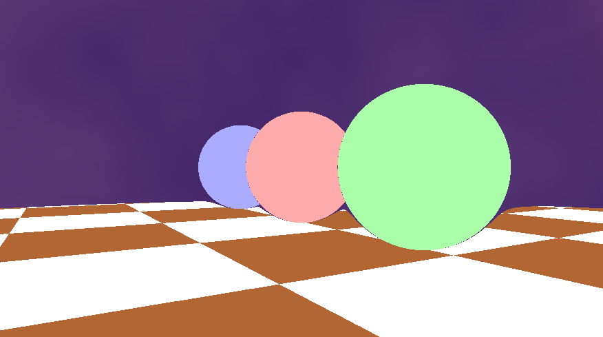
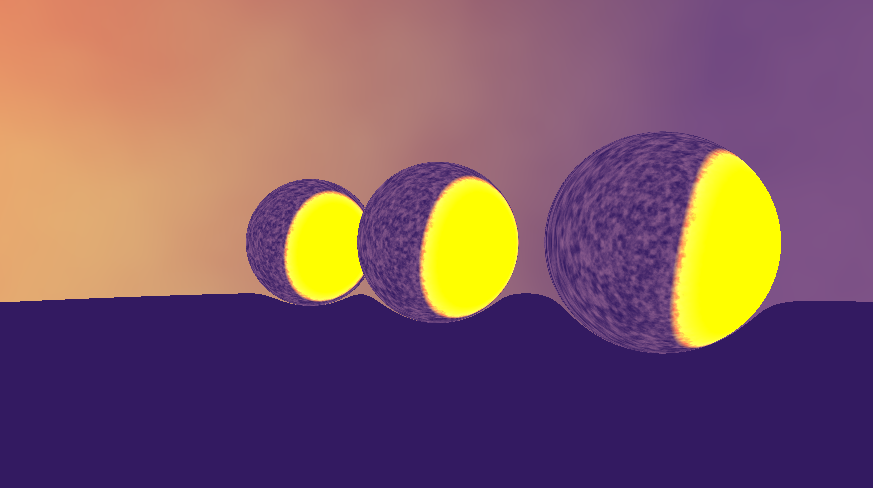
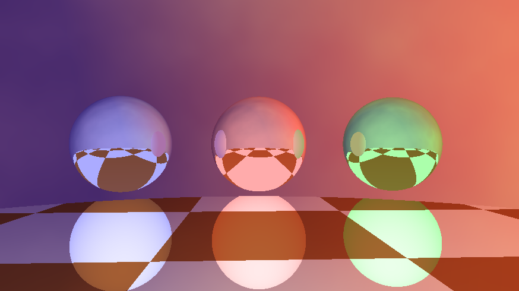
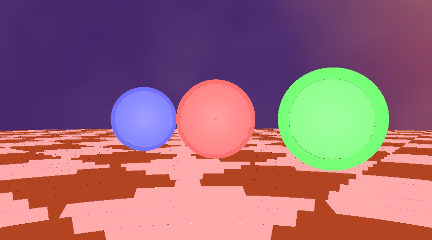

# lab02-debugging

[ShaderToy Link](https://www.shadertoy.com/view/3cXBWl)

# Bugs Resolved

**Shader Compile Error**

By compile logs, I corrected `vec` to `vec2`.

**Wrong Aspect Ratio**

I firstly wanted to solve the scene center issue, but I came across to raycast function and found out line 
`H *= len * iResolution.x / iResolution.x;` seemed not right and I changed the latter x to y and the aspect ratio became normal.

 **Centralize Scene**

 I found out this by comparing the output image of uv2 and dir. I used `fragColor = vec4(uv2, 0., 1.);` and `fragColor = vec4(dir, 0., 1.);` to debug and found out dir did
 not centered with 0 value. And I checked main function, found out uv was passed to raycast instead of uv2.

 **Reflection Issue**

 I firstly outputted material to the scene:
 `return Intersection(t, material, isect, hitObj);`

 

 which I did not find any issue. Then I tried to substitude some variable in the if branch in sdf3D, e.g. using `if(true||hitObj==-1)` or drop fresnel term. At first I outputed the specReflCol in that way, and it seemed quite weird,
 
 
 
 Therefore I thought the normal was in wrong direction, since y axis pointed to the sky. Then I tested to output normal color, I even tried to modify computeNormal in Common file, and let the camera rotate to see anything occurred, but did not find any issue. Then I decided to check every function that sdf3D called after the first computeMaterial. the first one was, very fortunately, `reflect`. I googled that function and found out it was used incorrectly. Then I corrected that and reflection appeared. 

 **Ray Marching Issue**

 I got the hint that bug only existed in Image file, after I had done a lot of research on Common file. Given the issue seemed to mostly caused by march function I tweaked parameters in march. I firstly tweaked `m < 0.01` to smaller values, e.g. 0.0001, but the scene seemed worse which is strange. It curved out at a distance of the ground. 

 

 Then I noticed `t+=m`, then I tried with something like `t+=1.` and that gap between sphere and ground disappeared. 
 
 
 
 Then I realized it was the issue of t and it could not reach far enough so I tried to tweak `for(int i = 0; i < 64; ++i)` with higher values, and problem solved. 